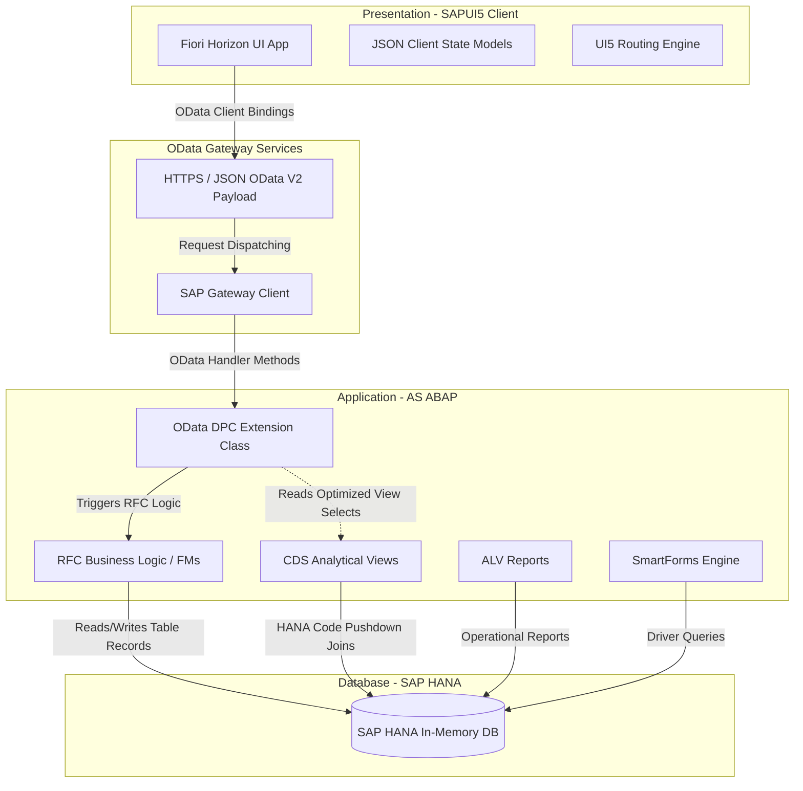
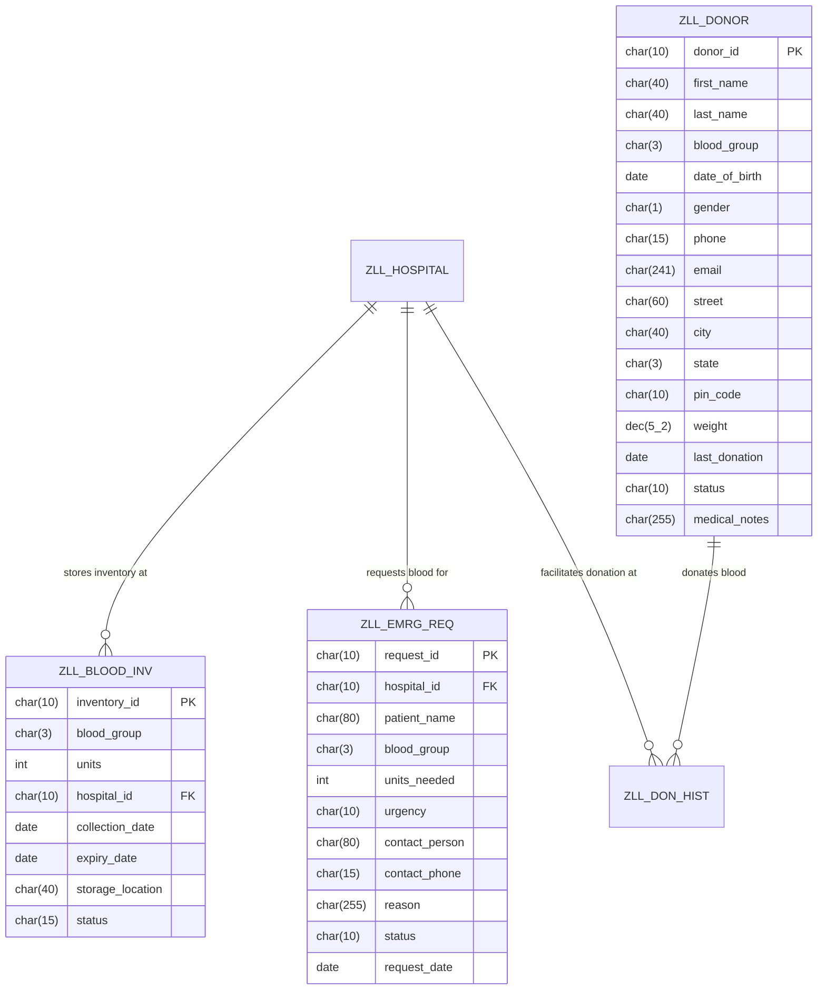

# 🩸 LifeLink – Blood Donation & Emergency Request System

[](https://www.sap.com/)
[](https://developer.sap.com/topics/abap-platform.html)
[](https://sdk.openui5.org/)
[](https://www.sap.com/products/technology-platform/hana.html)
[](https://www.odata.org/)
[](https://opensource.org/licenses/MIT)

**LifeLink** is an enterprise-grade, full-stack SAP application designed to unify and streamline communication between blood donors, hospitals, and blood banks. Built on **SAP Fiori design principles**, the solution leverages a responsive **SAPUI5** frontend alongside a high-performance **SAP S/4HANA ABAP** backend using Core Data Services (CDS) views, custom RFC-enabled Function Modules, and Gateway OData V2 integration.

---

## 🖥️ Graphical User Interface (Preview)

The application features a modern SAP Fiori Horizon-themed dashboard, donor search tables, interactive charts, and forms designed for rapid data input during critical emergency conditions.

```
+---------------------------------------------------------------------------------------+
|  🩸 LifeLink | Dashboard     [Donor Registry]  [Inventory]  [Requests]  [Reports]     |
+---------------------------------------------------------------------------------------+
|  +-------------------+  +-------------------+  +-------------------+  +------------+  |
|  | Active Donors     |  | Total Blood Units |  | Pending Requests  |  | Expiring   |  |
|  |     1,248         |  |      342          |  |       12          |  |  5 Units   |  |
|  +-------------------+  +-------------------+  +-------------------+  +------------+  |
|                                                                                       |
|  +--------------------------------------------+  +---------------------------------+  |
|  | 📊 Monthly Blood Donations (Volume in L)   |  | 🩸 Inventory Share by Blood Grp |  |
|  |                                            |  |      [A+] 35%   [O-] 25%        |  |
|  |   [###]    [###]    [###]    [###]         |  |      [B+] 20%   [AB+] 20%       |  |
|  +--------------------------------------------+  +---------------------------------+  |
+---------------------------------------------------------------------------------------+
```

---

## 🚀 Key Modules & Capabilities

### 1. Interactive KPI Dashboard
* **Real-time Metrics**: Dynamic analytical tiles display Active Donors, Stocked Units, Urgent/Pending Requests, and units approaching their shelf-life limit.
* **Visual Analytics**: Utilizes `sap.viz` charting components (VizFrame) to display donation trends and distribution graphs.

### 2. Donor Registry & Eligibility Check
* **Master Records**: Comprehensive profile management for donors (contact, weight, location, blood group, last donation timestamp).
* **Automated Eligibility Engine**: Business logic validates donation constraints in real time (e.g., minimum 56 days between donations, body weight $\ge$ 45 kg, active registration status).

### 3. Blood Inventory Lifecycle Tracker
* **Real-time Inventory**: Tracks individual blood bags, storage locations (room/fridge/shelf details), and collection dates.
* **Shelf-Life Management**: System automatically calculates expiry dates (42-day standard shelf life for red blood cells) and marks bags as `AVAILABLE`, `EXPIRING` (within 5 days), or `EXPIRED`.

### 4. Emergency Request Pipeline
* **High-Priority Matching**: Allows hospitals to log critical blood requests with urgency tiers (`CRITICAL`, `HIGH`, `NORMAL`, `LOW`).
* **Automated Dispatch**: System processes requests by finding the oldest available compatible units (FIFO queue to minimize expiry waste).
* **Approval Workflows**: Multi-stage state machine (`PENDING` ➔ `APPROVED` ➔ `COMPLETED` or `REJECTED`) tracks admin approvals.

### 5. SmartForms Print Generation
* **Donation Certificates**: Generates high-fidelity PDF certificates automatically on donor check-out.
* **Emergency Dispatch Slips**: Produces release authorization slips for hospital transport couriers.

---

## 🏛️ System Architecture

LifeLink is structured as an optimized **Three-Tier SAP architecture** utilizing modern OData Gateway dispatching:



---

## 🗄️ Database Schema & Data Dictionary

The database consists of 5 core SAP transparent tables optimized for memory performance inside SAP HANA:

* **`ZLL_DONOR`**: Stores primary donor details, demographics, and contact metadata.
* **`ZLL_HOSPITAL`**: Master table for hospitals, locations, and contact details.
* **`ZLL_BLOOD_INV`**: Stock table tracking units, expiration date, and status.
* **`ZLL_EMRG_REQ`**: Request pipelines for emergency transfers.
* **`ZLL_DON_HIST`**: Transaction log for auditing every donation.

### ER Diagram:



---

## 📁 Repository Structure

```
LifeLink/
├── frontend/                          # SAPUI5 UI Application (Fiori Horizon)
│   ├── webapp/
│   │   ├── controller/                # XML View Controller JavaScripts
│   │   ├── view/                      # XML Layout Declarations
│   │   ├── fragment/                  # Reusable UI overlays & Value Helps
│   │   ├── model/                     # Formatters & UI5 State Factories
│   │   ├── localService/              # Mock Data, Metadata.xml & local MockServer
│   │   └── css/                       # Custom Brand Extensions
│   ├── ui5.yaml                       # Local server and routing configurations
│   └── package.json                   # UI5 Tooling dependencies
│
├── backend/                           # SAP S/4HANA Backend Artifacts
│   ├── data-dictionary/               # DDIC Tables, Domains, Data Elements
│   ├── cds-views/                     # Core Data Services (DDL annotations)
│   ├── odata-services/                # ABAP Gateway DPC Extension classes
│   ├── function-modules/              # RFC transaction logic & checks
│   ├── reports/                       # Classic ALV Administration Reports
│   └── smartforms/                    # PDF SmartForms Layout & Drivers
│
└── docs/                              # Detailed Technical & Process Manuals
    ├── architecture.md                # Component Architecture
    ├── database-schema.md             # Transparent Table Definitions
    ├── api-documentation.md           # API endpoints & OData specification
    ├── functional-spec.md             # Detailed User Journeys & Flows
    ├── technical-spec.md              # Code Specs and DB structures
    ├── dfd.md                         # Process Data Flow Diagrams
    └── setup-guide.md                 # Deployment Instruction Manual
```

---

## 🚀 Installation & Local Execution

### 1. Run the Frontend (SAPUI5 Mock Server)
To preview the client-side Fiori app running on node-based mock services without requiring live connection credentials:

```bash
# Navigate to UI folder
cd frontend

# Install UI5 CLI and tooling packages
npm install

# Start local server with UI5 server watch
npm start
```
*The browser will launch automatically at `http://localhost:8080/index.html`.*

### 2. Install Backend Objects (S/4HANA System)
1. **DDIC Schema**: Import structures from [data-dictionary/](backend/data-dictionary) using Eclipse ADT or T-Code `SE11`.
2. **CDS Views**: Deploy DDL source files under [cds-views/](backend/cds-views) using Eclipse ADT.
3. **Function Modules**: Create function group `ZLL_FG_MAIN` via `SE37` and implement [function-modules/](backend/function-modules/).
4. **OData Gateway**: Create Gateway project `ZLL_ODATA_PROJECT` using `SEGW`. Redefine `ZCL_ZLL_ODATA_DPC_EXT` with [odata-services/ZLL_ODATA_DPC_EXT.abap](backend/odata-services/ZLL_ODATA_DPC_EXT.abap). Register the OData service using `/IWFND/MAINT_SERVICE`.
5. **ALV Reports**: Load administrative report files from [reports/](backend/reports) using `SE38`.
6. **SmartForms**: Build forms using `SMARTFORMS` transaction using layout rules in [smartforms/](backend/smartforms).

---

## 🔒 Security & Credentials Policy
This repository follows strict corporate compliance rules:
* **Zero Secrets Leakage**: No database passwords, SAP client user IDs, API keys, or production host IPs are checked into this codebase.
* **Gateway Layer Abstraction**: Dynamic OData routing avoids hardcoded target servers. Host targets are mapped externally using standard SAP Gateway Destinations (`SM59`).
* **Mock Server Integration**: The local environment runs purely via a sandbox `MockServer` that mocks live requests in-memory.

---

## 📄 License
This project is licensed under the MIT License - see the [LICENSE](LICENSE) file for details.
