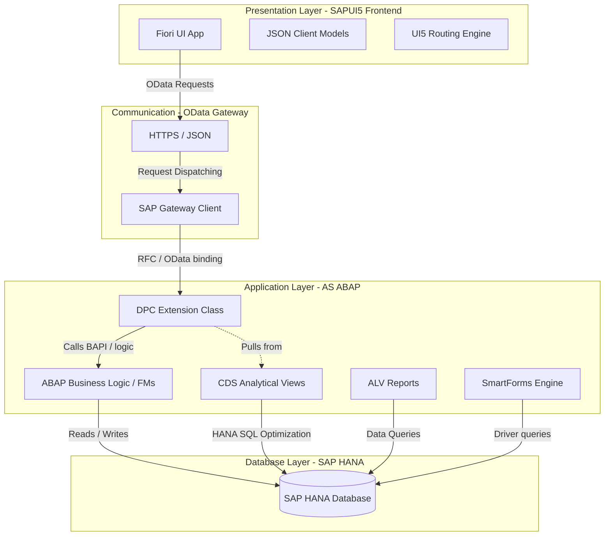

# 🏛 LifeLink System Architecture

This document describes the architectural layout, components, and data flow of **LifeLink – Blood Donation & Emergency Request System**.

---

## 🗺 System Architecture Overview

The system follows a classic **Three-Tier SAP architecture** (Presentation, Application, and Database), optimized for **SAP Fiori UI** consuming RESTful OData services on **SAP S/4HANA**.

---

## 📂 Architectural Layers

### 1. Presentation Layer (SAPUI5 Frontend)
*   **Architecture Pattern**: Model-View-Controller (MVC).
*   **Views**: Declarative XML Views describing responsive controls (Fiori Horizon design system).
*   **Controllers**: JavaScript code handling user events, formatting outputs, driving routes, and validating inputs.
*   **Models**: 
    *   `ODataModel (V2)`: Connects to the SAP Gateway services automatically handling batch updates and metadata binding.
    *   `JSONModel`: Local client-side models representing local state, device properties, and form inputs.
*   **Routing**: Defined inside `manifest.json` using hash-based navigation for deep-linking.

### 2. Communication Channel (SAP Gateway & OData)
*   **Protocol**: OData V2 (RESTful architecture carrying JSON or AtomPub XML payloads).
*   **Gateway Hub**: Manages security tokens (CSRF), user authorization, payload serialization, and requests batching.

### 3. Application Layer (AS ABAP)
*   **Model Provider Class (MPC)**: Generated class mapping ABAP DDIC structures to OData entity types and properties.
*   **Data Provider Class (DPC_EXT)**: Custom class implementing database actions (Create, Read, Update, Delete) and triggering transactional workflows.
*   **CDS Views**: Core Data Services executing directly inside the HANA DB engine to compute analytical KPIs, joins, and aggregates instantly.
*   **Function Modules**: Encapsulated transaction blocks containing domain logic (eligibility, stock checks, state transitions).
*   **SmartForms**: Backend print engine used to compile PDF binary buffers for client-side download.

### 4. Database Layer (SAP HANA)
*   **HANA Transparent Tables**: Store transactional data (Donors, Inventory, Requests, Donations, Hospitals).
*   **In-Memory Optimization**: Leveraging columnar index processing for real-time reporting.

---

## 🔄 Transactional Data Flows

### A. Registering a Donor
1. User enters donor parameters into the UI form and clicks **Save**.
2. Frontend runs input validation rules; if correct, sends an `HTTP POST` request to `/DonorSet`.
3. SAP Gateway captures the request, performs CSRF token verification, and forwards it to `ZCL_ZLL_ODATA_DPC_EXT->DONORSET_CREATE_ENTITY`.
4. The DPC class generates a unique Donor ID and runs the function module `ZLL_FM_CREATE_DONOR`.
5. The FM verifies duplicate entries and inserts the record into HANA table `ZLL_DONOR`.
6. Transaction is committed; success HTTP code `201 Created` with the new Donor payload is returned to the frontend.
7. Frontend displays a Toast message and navigates back to the List page.

### B. Requesting Emergency Blood
1. A hospital staff creates an emergency request using the form.
2. An `HTTP POST` goes to `/EmergencyRequestSet`.
3. DPC inserts a record into database table `ZLL_EMRG_REQ` with status `PENDING`.
4. If urgency is marked `Critical`, a system alert is triggered.
5. The Admin views the request and clicks **Approve**.
6. Frontend executes a function import `ApproveRequest` via OData.
7. Backend executes the function module `ZLL_FM_PROCESS_REQUEST` which validates state transitions, sets status to `APPROVED`, and logs approvals.
8. The stock in `ZLL_BLOOD_INV` is checked.
