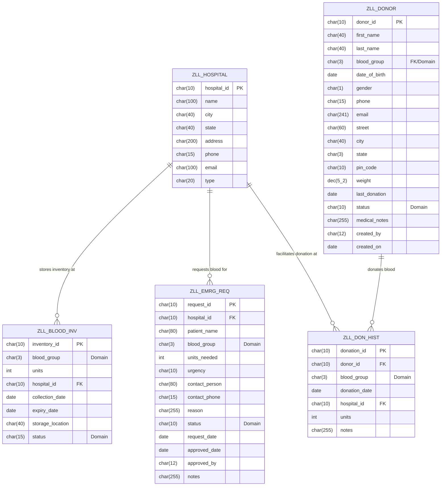

# 🗄 LifeLink Database Schema & ER Diagram

This document outlines the SAP HANA transparent tables, data dictionaries, and structural associations for the LifeLink system.

---

## 📊 Entity-Relationship Diagram (ERD)

---

## 🗂 Transparent Tables Dictionary

### 1. ZLL_DONOR (Donor Master Table)
Stores primary information for registered blood donors.

| Field | Data Element | Data Type | Length | Decimals | Key | Short Description |
| :--- | :--- | :--- | :--- | :--- | :--- | :--- |
| **MANDT** | MANDT | CLNT | 3 | 0 | Yes | Client ID |
| **DONOR_ID** | ZLL_DE_DONOR_ID | CHAR | 10 | 0 | Yes | Donor Identification Code |
| **FIRST_NAME** | ZLL_DE_FIRST_NAME | CHAR | 40 | 0 | No | First Name |
| **LAST_NAME** | ZLL_DE_LAST_NAME | CHAR | 40 | 0 | No | Last Name |
| **BLOOD_GROUP** | ZLL_DE_BLOOD_GROUP| CHAR | 3 | 0 | No | Blood Group Code |
| **DATE_OF_BIRTH**| DATS | DATS | 8 | 0 | No | Date of Birth |
| **GENDER** | ZLL_DE_GENDER | CHAR | 1 | 0 | No | Gender (M/F/O) |
| **PHONE** | ZLL_DE_PHONE | CHAR | 15 | 0 | No | Phone Number |
| **EMAIL** | AD_SMTPADR | CHAR | 241 | 0 | No | E-mail Address |
| **STREET** | AD_STREET | CHAR | 60 | 0 | No | Street Address |
| **CITY** | AD_CITY1 | CHAR | 40 | 0 | No | City Location |
| **STATE** | REGIO | CHAR | 3 | 0 | No | State Region |
| **PIN_CODE** | AD_PSTCD1 | CHAR | 10 | 0 | No | Postal PIN Code |
| **WEIGHT** | ZLL_DE_WEIGHT | DEC | 5 | 2 | No | Body Weight (kg) |
| **LAST_DONATION**| DATS | DATS | 8 | 0 | No | Last Donation Date |
| **STATUS** | ZLL_DE_DONOR_STAT | CHAR | 10 | 0 | No | Status (ACTIVE / INACTIVE) |
| **MEDICAL_NOTES**| ZLL_DE_NOTES | CHAR | 255 | 0 | No | Medical Conditions/Alerts |

---

### 2. ZLL_BLOOD_INV (Blood Inventory Table)
Tracks blood unit stock inside hospital storage containers.

| Field | Data Element | Data Type | Length | Key | Description |
| :--- | :--- | :--- | :--- | :--- | :--- |
| **MANDT** | MANDT | CLNT | 3 | Yes | Client ID |
| **INVENTORY_ID**| ZLL_DE_INV_ID | CHAR | 10 | Yes | Blood Inventory ID |
| **BLOOD_GROUP** | ZLL_DE_BLOOD_GROUP| CHAR | 3 | No | Blood Group |
| **UNITS** | INT4 | INT | 4 | No | Available Units Count |
| **HOSPITAL_ID** | ZLL_DE_HOSP_ID | CHAR | 10 | No | FK Hospital ID Location |
| **COLLECTION_DATE**| DATS | DATS | 8 | No | Storage Date |
| **EXPIRY_DATE** | DATS | DATS | 8 | No | Expiration Date (Collection + 42 days) |
| **STORAGE_LOC** | ZLL_DE_STORAGE | CHAR | 40 | No | Storage Bin / Room |
| **STATUS** | ZLL_DE_INV_STATUS | CHAR | 15 | No | Stock Status (Available/Expiring/Expired)|

---

### 3. ZLL_EMRG_REQ (Emergency Blood Requests)
Tracks incoming emergency requests submitted by hospital departments.

| Field | Data Type | Length | Key | Description |
| :--- | :--- | :--- | :--- | :--- |
| **MANDT** | CLNT | 3 | Yes | Client ID |
| **REQUEST_ID** | CHAR | 10 | Yes | Request ID |
| **HOSPITAL_ID** | CHAR | 10 | No | Hospital raising request |
| **PATIENT_NAME**| CHAR | 80 | No | Patient Name |
| **BLOOD_GROUP** | CHAR | 3 | No | Blood Group Requested |
| **UNITS_NEEDED**| INT | 4 | No | Count of Units |
| **URGENCY** | CHAR | 10 | No | Critical / High / Normal / Low |
| **CONTACT_PERSON**| CHAR | 80 | No | Requesting physician name |
| **CONTACT_PHONE**| CHAR | 15 | No | Primary phone contact |
| **REASON** | CHAR | 255 | No | Medical justification |
| **STATUS** | CHAR | 10 | No | PENDING/APPROVED/REJECTED/COMPLETED |
| **REQUEST_DATE**| DATS | 8 | No | Request creation date |
| **APPROVED_DATE**| DATS | 8 | No | Review approval date |
| **APPROVED_BY** | CHAR | 12 | No | Processor user ID |

---

### 4. ZLL_DON_HIST (Donation History Log)
Keeps an immutable transactional trail of all donation operations.

| Field | Data Type | Length | Key | Description |
| :--- | :--- | :--- | :--- | :--- |
| **MANDT** | CLNT | 3 | Yes | Client ID |
| **DONATION_ID** | CHAR | 10 | Yes | Donation transaction ID |
| **DONOR_ID** | CHAR | 10 | No | Donor ID reference |
| **BLOOD_GROUP** | CHAR | 3 | No | Blood group collected |
| **DONATION_DATE**| DATS | 8 | No | Date of donation |
| **HOSPITAL_ID** | CHAR | 10 | No | Collection center hospital |
| **UNITS** | INT | 4 | No | Units collected (typically 1) |
| **NOTES** | CHAR | 255 | No | Medical log |

---

### 5. ZLL_HOSPITAL (Hospital Master Table)
Holds hospital locations and details.

| Field | Data Type | Length | Key | Description |
| :--- | :--- | :--- | :--- | :--- |
| **MANDT** | CLNT | 3 | Yes | Client ID |
| **HOSPITAL_ID** | CHAR | 10 | Yes | Hospital ID |
| **NAME** | CHAR | 100 | No | Hospital Name |
| **CITY** | CHAR | 40 | No | City |
| **STATE** | CHAR | 40 | No | State |
| **ADDRESS** | CHAR | 200 | No | Full postal address |
| **PHONE** | CHAR | 15 | No | Primary phone |
| **EMAIL** | CHAR | 100 | No | E-mail address |
| **TYPE** | CHAR | 20 | No | Private / Government / Specialty |
