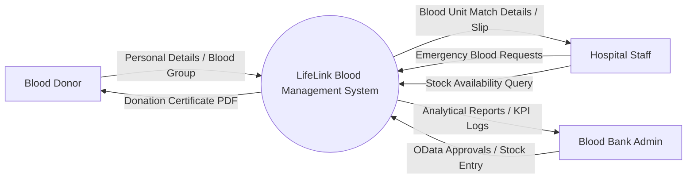
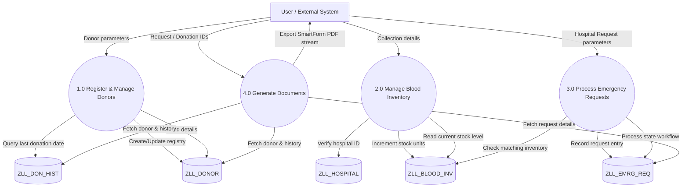
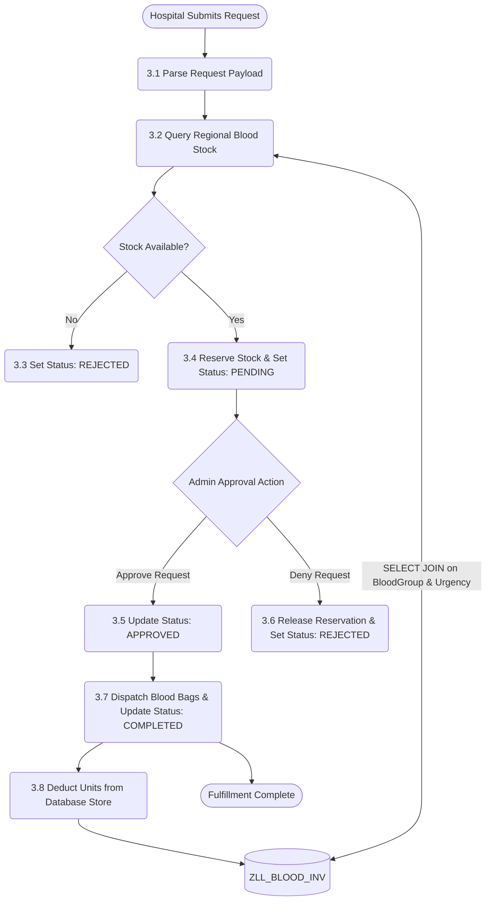

# 🌀 LifeLink Data Flow Diagrams (DFD)

This document describes the flow of information across the LifeLink application layers.

---

## 🟢 Level 0: Context Diagram

The Context Diagram defines the system boundary, external actors, and key information flows.

---

## 🟡 Level 1: Process Flow Diagram

Level 1 breaks down the core functional processing blocks and data stores.

---

## 🔴 Level 2: Detailed Process View (Fulfillment Workflow)

Level 2 drills down into the complex process of **Emergency Request Fulfillment**.

